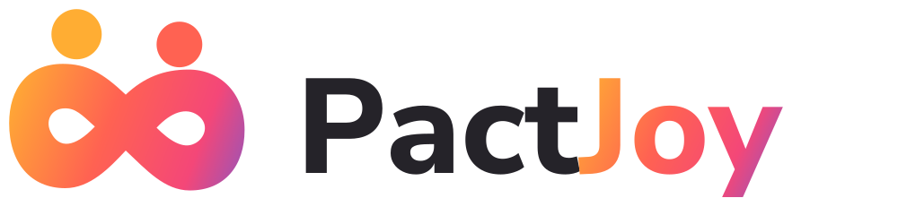

<div align="center">

<picture>
  <source media="(prefers-color-scheme: dark)" srcset=".github/assets/pactjoy-logo-dark.svg">
  
</picture>

### Compete with yourself. Play with others.

A social habits app where everyone pursues different goals and competes on a fair, shared score.

<br>

[](LICENSE)
[](#roadmap)
[](CONTRIBUTING.md)
[](#why-its-different)

[](https://www.typescriptlang.org/)
[](https://react.dev/)
[](https://vite.dev/)
[](https://web.dev/learn/pwa/)
[](https://supabase.com/)
[](https://vitest.dev/)
[](https://pnpm.io/)

[Why it's different](#why-its-different) · [Scoring](#how-scoring-works-short-version) · [Architecture](#architecture) · [Roadmap](#roadmap) · [License](#license)

</div>

---

## About

PactJoy is a social habits app for small circles (2–6 people, built first for two). Each person pursues **different goals**, yet everyone competes on a **common, fair score**: every participant has exactly **1,000 potential points per season**, split across their own commitments.

The goal is not the longest streak. It is to build habits until they no longer need tracking, and then **graduate** them.

**Status:** pre-alpha. The product specification and the MVP design are complete; implementation is starting with the scoring engine.

---

## Why it's different

- **Different goals, fair comparison.** Progress is measured against *your own commitment*, not against the type of activity. Running 5 km is not "worth more" than reading.
- **Minimum + ideal.** Each commitment has a viable minimum for hard days and an ideal. The minimum is a *threshold*, not free points: it counts for consistency, while only the ideal earns 100%.
- **A pact, not a punishment.** Members agree on each other's commitments before the season starts. Missing a day never subtracts points, and pausing (injury, travel) is neutral.
- **Privacy with fairness.** A commitment can be private and still count toward the ranking.
- **Graduation as the best outcome.** The app tracks self-reported automaticity (SRBAI) and lets you stop tracking a habit once it has become part of your routine.

## How scoring works (short version)

| Direction | Rule |
|---|---|
| **Reach** (more is better) | Below the minimum → 0%. From the minimum on → `value / ideal`, capped at 100%. |
| **Don't exceed** (less is better) | Up to the ideal → 100%. Linear down to 50% at the tolerance. Above the tolerance, or no entry → 0%. |

A commitment's points = `weight × 1,000 × average progress of its active opportunities`. All values are stored **exactly** (rational numbers, never floats) and rounded **only for display**, so the 1,000-point ceiling always holds.

Every rule comes with worked examples that double as **acceptance tests** for the engine.

## Documentation

The full product specification (mechanics, MVP scope, social experience) and the MVP design live in a **private** Notion workspace and design project. [CLAUDE.md](CLAUDE.md) links to them because it guides AI-assisted development, but those links are not publicly accessible.

The public, executable version of the rules is the acceptance test suite in `packages/engine`: each test is a worked example from the specification.

## Architecture

Hexagonal: the domain doesn't know which database, framework or runtime it runs on.

```
packages/engine      Pure domain: scoring, pauses, proration, streaks. Zero dependencies.
                     Exact fractions with BigInt. Injected clock.
packages/app         Use cases (log entry, request pause, approve pact, close week…) behind ports.
packages/db          Postgres adapter.
supabase/functions   Thin HTTP adapter (Edge Functions): validate JWT → call a use case.
apps/web             Installable PWA. Talks to its own API interface, never to tables directly.
```

Design rules that keep the backend replaceable (e.g. by a NestJS API):

- No business logic in Postgres (no triggers, SQL functions, or RLS rules beyond "you see your own circle").
- Shared packages use web-standard TypeScript/ESM only: no Deno- or Node-specific APIs.
- Every scheduled job is a use case; the scheduler only triggers it.
- Entries are the source of truth; points are **recomputed** from them.

## Tech stack

| Layer | Choice |
|---|---|
| Language | TypeScript everywhere (pnpm workspaces monorepo) |
| Client | PWA: Vite + React + vite-plugin-pwa |
| Backend | Supabase: Postgres, Auth, Storage, Edge Functions (Deno), pg_cron |
| Tests | Vitest |

## Roadmap

- [x] Product specification and scoring rules
- [x] MVP design (all views)
- [ ] Scoring engine + acceptance tests
- [ ] Database schema, use cases and API
- [ ] PWA: Today & logging → Season → Pact → Pause, review & close → Onboarding & circle
- [ ] Season 1: dogfooding with two people

## Contributing

Not accepting code contributions until the MVP is out. Issues and ideas are welcome. See [CONTRIBUTING.md](CONTRIBUTING.md).

## License

The source code is licensed under the **GNU Affero General Public License v3.0**. See [LICENSE](LICENSE).

If you run a modified version of PactJoy as a network service, the AGPL requires you to make your modified source code available to its users.

The **PactJoy name, logo and visual identity are not covered by the AGPL**. See [TRADEMARKS.md](TRADEMARKS.md).

Copyright © 2026 Victor Olave.
